> **VS-CodeでMDを開いてCTRL+SHIFT+Vでプレビュー表示できます。**

# 02. 環境確認　9:30-10:00
> 先に [99.トレサポ.md](./99.トレサポ.md) の説明を実施する事

## 1. 実行環境の説明

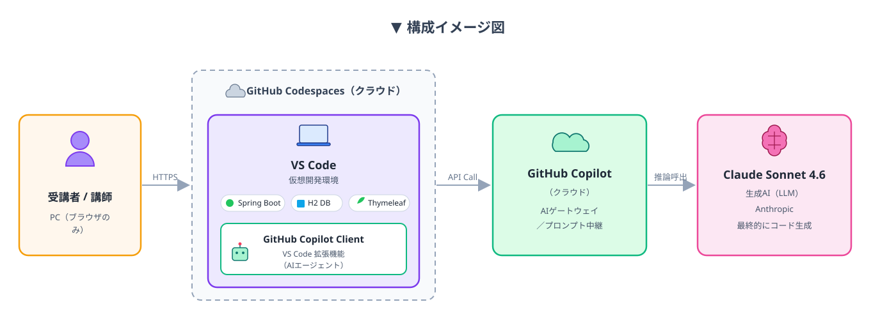

## 2. GithubCodespacesに接続
[GithubCodespacesのURL](https://github.com/ai-training-ORG/ai-training) にアクセスする

## 3. VS Codeの起動
#### step1:Codeボタン押下⇒CodeSpacesのタブ選択⇒CodeSpacesの＋ボタンを押下 
- ※日本語版の場合、コードボタン⇒符号空間のタブ選択⇒CodeSpacesの＋ボタンを押下
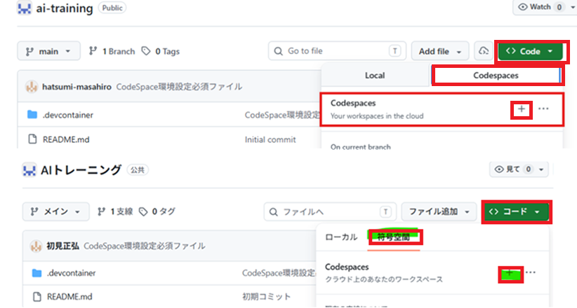

> ### ★Tips★
> 
> - デフォルトは白基調デザインになっていますが、黒基調に変更したい場合は設定マーク⇒テーマ⇒配色テーマで変更可能。
> - おすすめはダーク2026。お気に入りの配色にカスタマイズ可能。
>  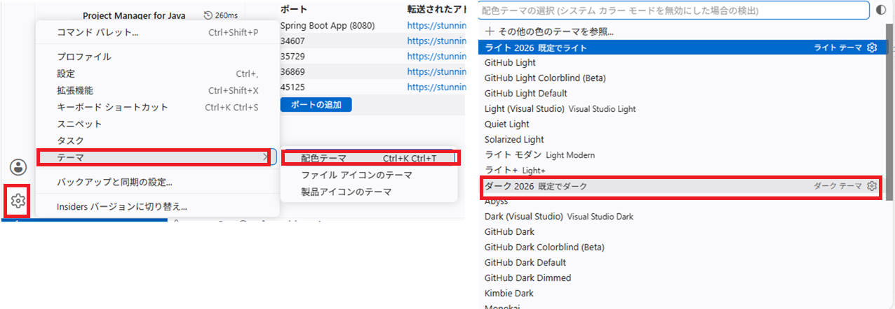

#### step2:ブラウザ上でVSCodeが起動するので、起動完了するまでしばらく待つ
※ VSCodeは初回起動時にインスタンスを立ち上げて、必要な拡張機能などを読み込んで起動完了となります。
起動中に後続手順を進めると正常に起動処理が行われず、後続手順に支障が出るので注意！

以下、起動中状態と起動完了状態の画面キャプチャを参考に判断すること
（不安な点があれば講師に確認ください）
##### 起動中のサンプル画面
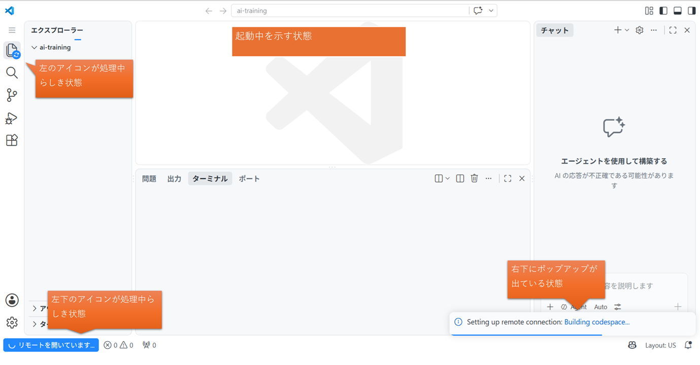
##### 起動完了のサンプル画面
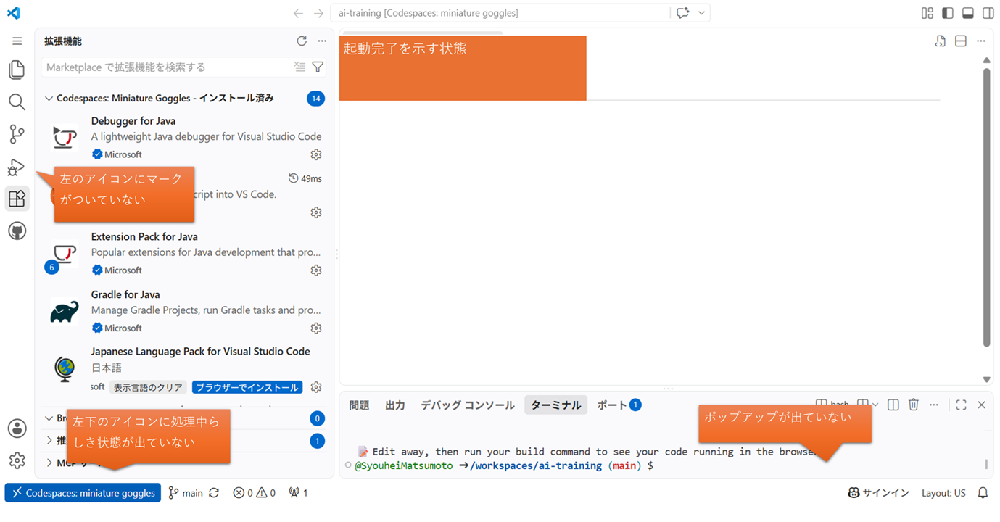

## 4. VS Codeへ資材配置

#### step1: ダウンロードした教材の画像のフォルダををVSCode上にドラッグ
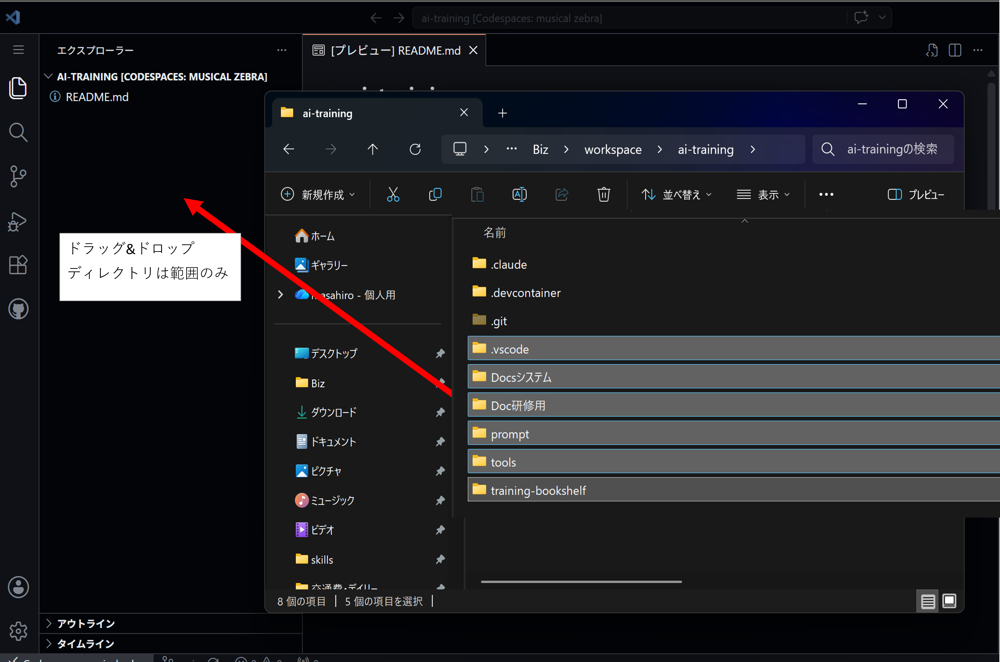

#### step2: VSCode上でマークダウンファイル「02.環境確認.md」を開き、プレビュー表示する
- エクスプローラーから「02.環境確認.md」を開く
- `Ctrl + Shift + V` を押してプレビュー表示する
- 以後の手順は、VSCode上でこのファイルのプレビューを表示した状態で進めてください
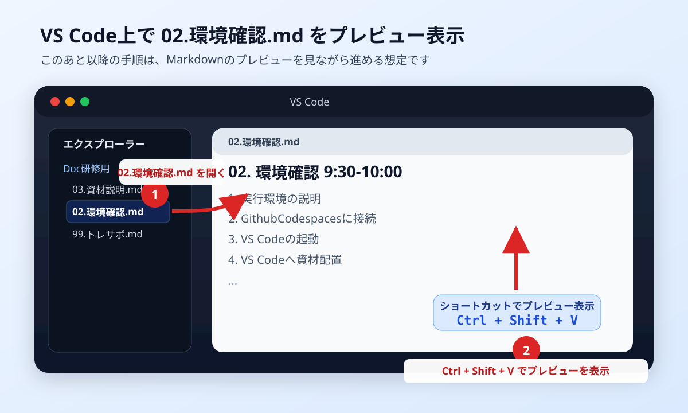

#### step3: javaプロジェクトのインポートを押下
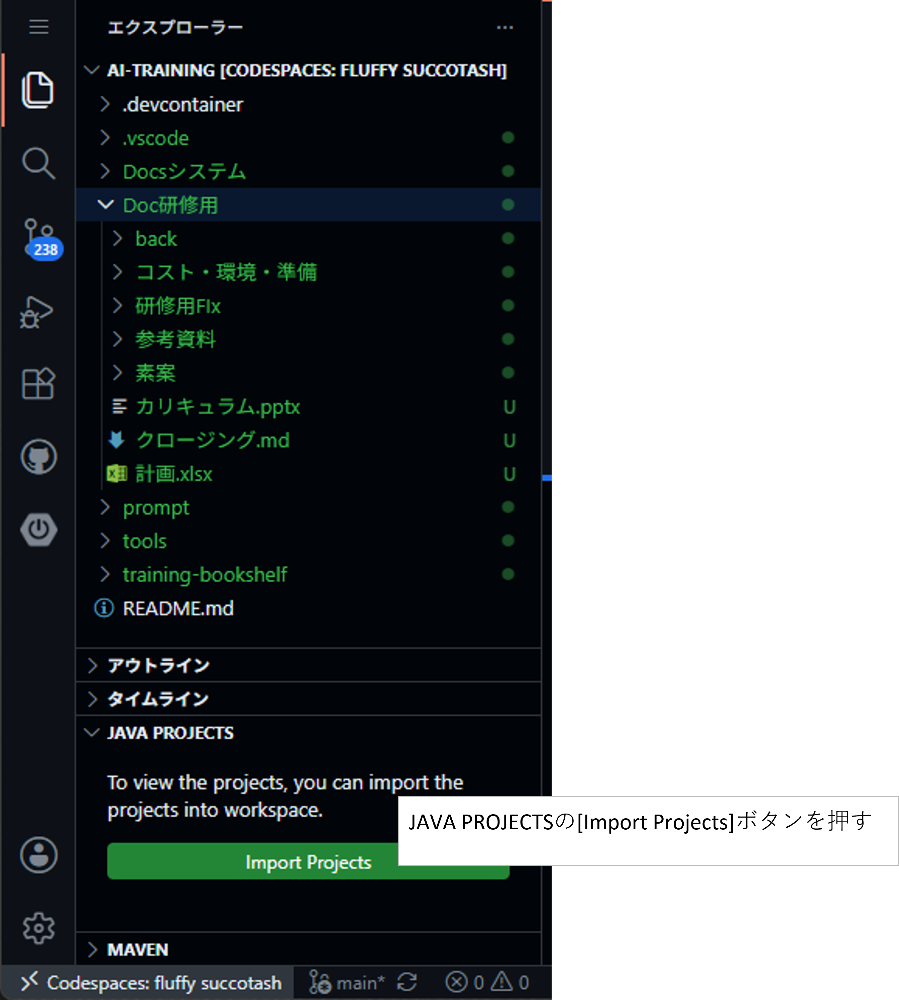
> ### ★Tips★
> 
> Import Projectボタンが表示されない場合、以下を試してみてください。
> - training-bookshelf配下のsrc/main/配下のjavaファイルを開く
> - 上記で表示されない場合は、ブラウザの更新（F5）を押下してください。この時、ポップアップが表示されても無視してOK
> - それでも表示されない場合は、拡張機能ボタン⇒vscode-java-packと入力して検索⇒Extension Pack for Javaがインストールされていることを確認
> 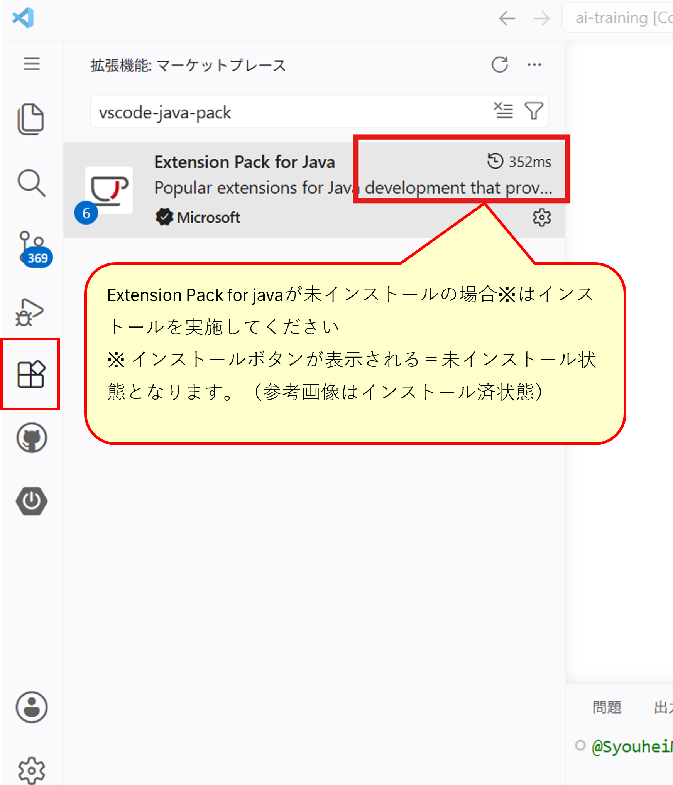
> - それでも表示されない場合は、講師へHelpをお願いします。
> 講師と一緒に以下手順にてCodeSpaceコンテナをリビルドします。
>> 　①コマンドパレットを開く
>>　　Ctrl + Shift + P
>> 　②Rebuild と入力して、以下を選ぶ
>> 　　Codespaces: Rebuild Container
>> 　③ダイアログから「Rebuild」を選択
>> 　④右下に「Rebuilding container...」と表示されてから数分待機
>> 　⑤再接続（再リロード）されることを確認（手動で再接続ボタンは適宜押してOK）
>> 　⑥Extension Pack for Javaがインストールされていることを確認

> 以後の手順も、ブラウザではなくVSCode上のMarkdownプレビューを見ながら進めてください。

## 5. GithubCopilotの起動

#### step1: サインイン確認  
- VS Code 右下のステータスバーにある Copilot アイコン（下図 丸部分 ）をクリックする  
- サインインしていない場合は「Sign in to use Copilot」を選択し、GitHub アカウントでサインインする  
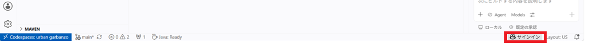 

#### step2: モデル設定  
- Copilot チャットパネルを開く（左アクティビティバーの Copilot アイコン、または `Ctrl+Alt+I`）  
- チャット入力欄下部に表示されているモデル選択ボタン（下図 四角部分 ）をクリックする  
- 「**Claude Sonnet 5**」を選択する（ワンクリックで選択肢に出ない場合は「その他のモデル」から探してください）
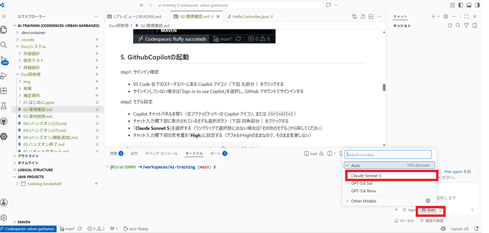 

#### step3: 思考量の設定確認
- チャット入力欄下部の思考量を「**High**」に設定する（デフォルトhighのままなので、そのまま変更しない）  
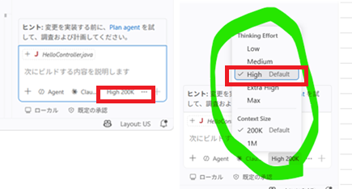  

#### step4: Hello Copilot! と話しかける
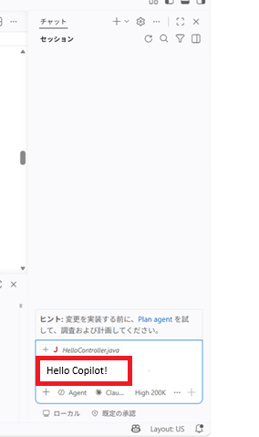 

## 6. ApplicationServer起動
#### サイドバーからSpringアイコン押下⇒training-bookshelfの起動ボタンを押下
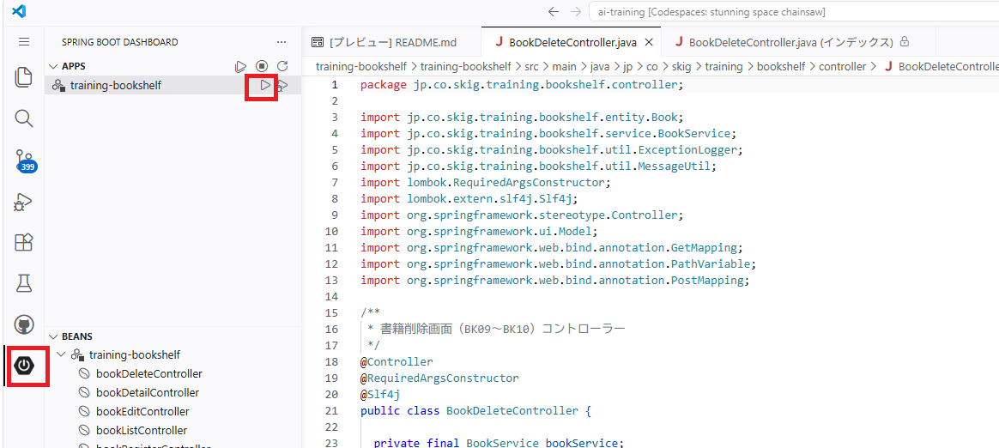

> ### ★Tips★
> 
> Springアイコンが表示されない場合、以下を試してみてください。
> - training-bookshelf配下のsrc/main/配下のjavaファイルを開く
> - 上記で表示されない場合は、ブラウザの更新（F5）を押下してください。この時、ポップアップが表示されても無視してOK
> - それでも表示されない場合は、拡張機能ボタン⇒Springと入力して検索⇒SpringBootExtensonsPackがインストールされていることを確認
> 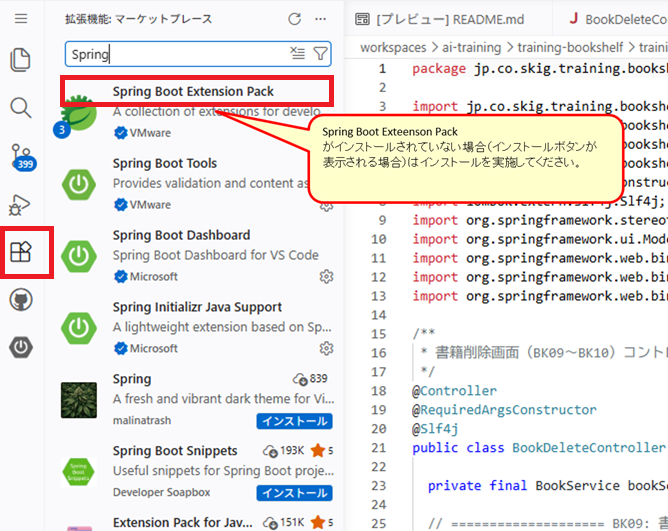
> - 上記でも表示されない場合は、メニューアイコン押下⇒表示ボタン押下⇒ビューの表示⇒SpringBootDashbordを選択
> 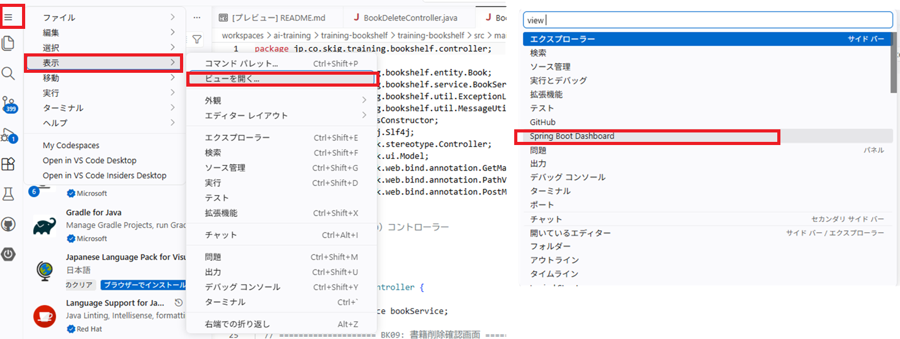
>  `Ctrl+Shift+P` → `Spring Boot Dashboard: Refresh`
> - それでも表示されない場合は、講師へHelpをお願いします。
> 講師と一緒に以下手順にてCodeSpaceコンテナをリビルドします。
>> 　①コマンドパレットを開く
>>　　Ctrl + Shift + P
>> 　②Rebuild と入力して、以下を選ぶ
>> 　　Codespaces: Rebuild Container
>> 　③ダイアログから「Rebuild」を選択
>> 　④右下に「Rebuilding container...」と表示されてから数分待機
>> 　⑤再接続（再リロード）されることを確認（手動で再接続ボタンは適宜押してOK）
>> 　⑥SpringBootExtensonsPackがインストールされていることを確認

> 
> （参考情報）コマンド起動する場合は以下手順を実施 
>- terminal起動
>- `cd training-bookshelf`
>- `chmod +x ./mvnw`
>- `mvn spring-boot:run` を実行

## 7. アプリケーションの起動結果確認

#### step1: ブラウザで開く
ポートタブを押下⇒SpringBootの行のブラウザマークを押下する。
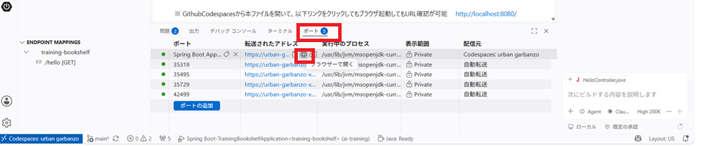

#### step2: URLの最後に「/hello」を付与する
エラー画面が表示されているが気にせず、「/hello」をURLの最後に付与する。
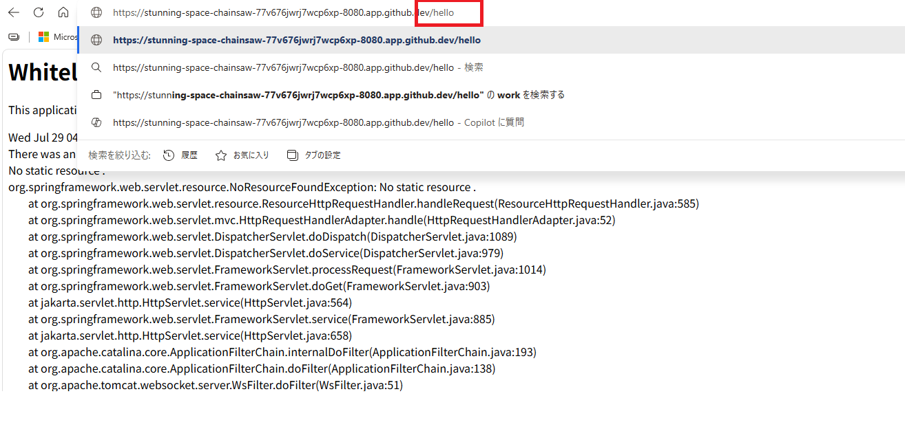

#### step3: 「Hello, World!」が表示されることを確認する
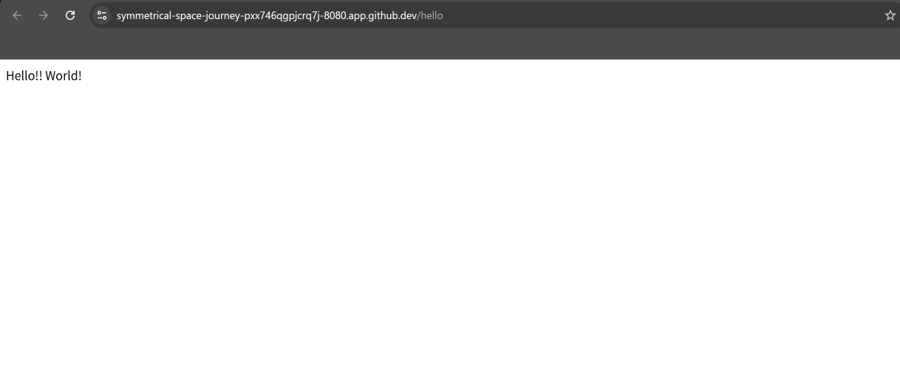

> ### ★Tips★
> 
> - GithubCodespacesから本ファイルを開いて、以下リンクをクリックしてブラウザ起動してもURL確認が可能
> - http://localhost:8080/

## 8. Git操作

> ⚠ **作業に入る前に一旦ここで Git Commit してください**（ロールバックポイント出来るように）  

### Gitの基本操作（ステージング／コミット／プッシュ）

本研修のソース管理は **Git**（GitHub）です。

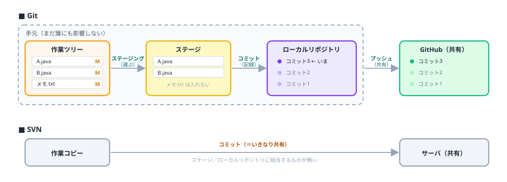

- **ステージング** … コミットするファイルを選ぶ
- **コミット** … **手元の**履歴に記録する（他の人には影響しない）
- **プッシュ** … GitHubへ送る（**共有されるのはこの時だけ**）

SVNは「コミット＝即共有」の1段階でしたが、Gitはコミットしても手元に留まります。  
つまり **コミットは気軽に何度でもOK**、AIに作業させる前に打っておけばロールバックポイントになります。

> 研修ではコミットまでを使います（プッシュはしません）。

1. 全ての変更をステージング  
変更

2. コミット
コミットメッセージを適当に書いてコミットする

## 9. クロージング
ここまでで環境確認は完了です  
トレサポアプリの状態を更新してください  
